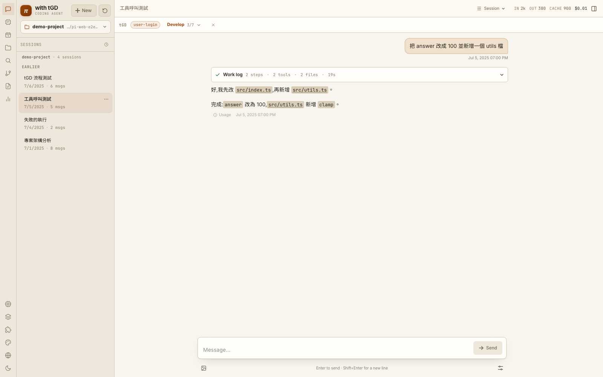
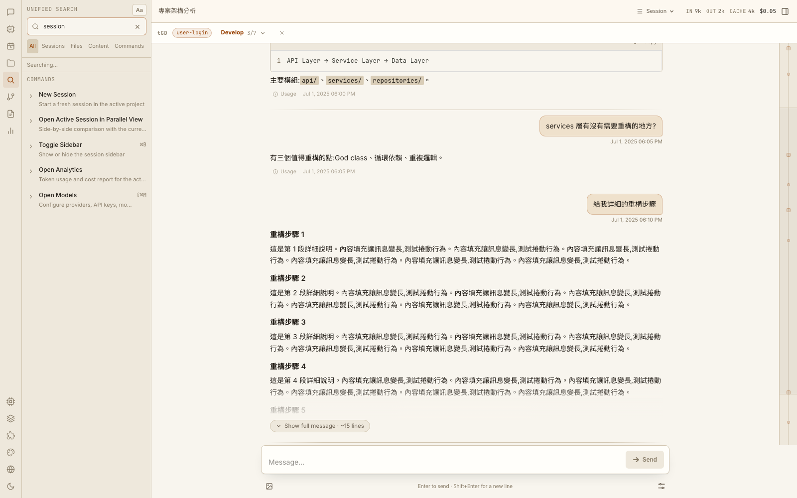
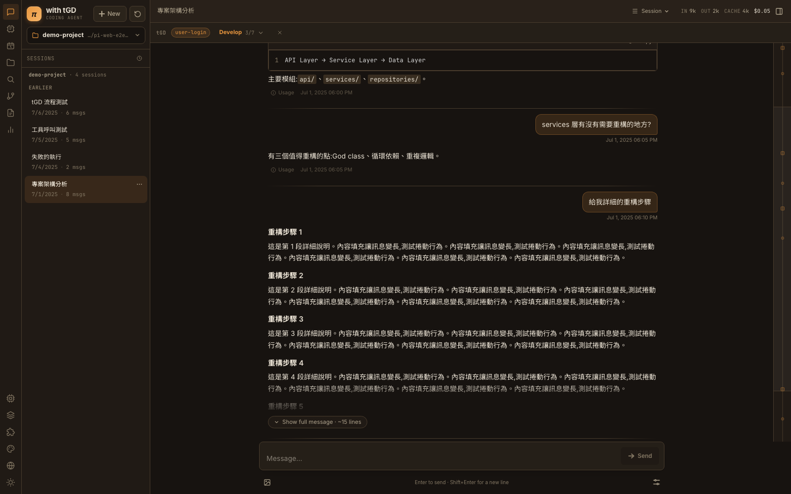
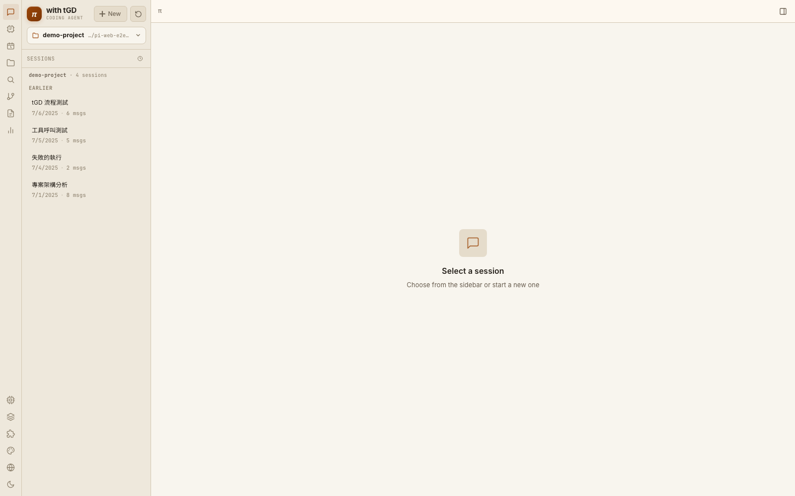
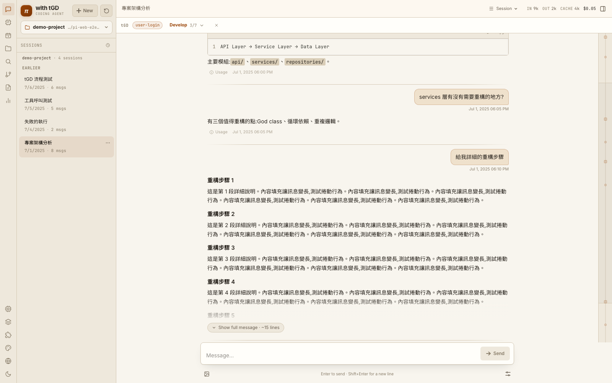
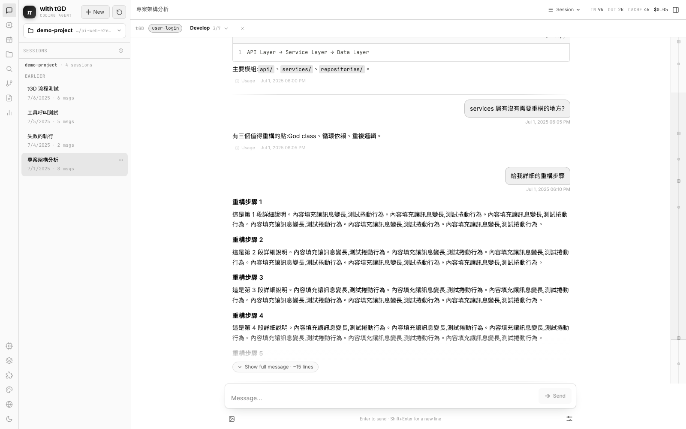
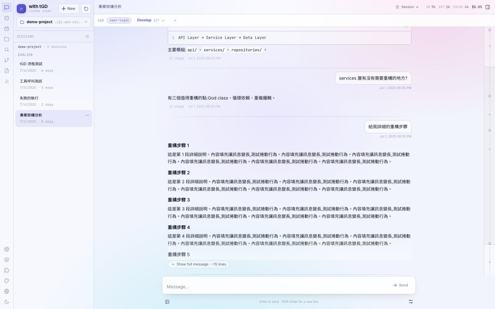

# tGD Pi Web

<p align="center">
  <a href="https://github.com/yhwangtw/tgd-pi-web/actions/workflows/ci.yml"></a>
  
  
</p>

<p align="center">
  <a href="README.md"><strong>English</strong></a> |
  <a href="README.zh-TW.md">繁體中文</a> |
  <a href="README.ja.md">日本語</a> |
  <a href="README.de.md">Deutsch</a>
</p>

<p align="center">
  <a href="https://github.com/yhwangtw/tgd-pi-web/releases">Releases</a> ·
  <a href="https://github.com/yhwangtw/tgd-pi-web/issues">Report a bug</a> ·
  <a href="https://github.com/yhwangtw/tgd-pi-web/issues">Request a feature</a>
</p>

**A browser workspace for Pi Coding Agent and the complete tGD delivery workflow.**

tGD Pi Web turns Pi's local sessions into a visual engineering cockpit: chat with the agent in real time, inspect files and git changes, move between branches, restore snapshots, and follow work from Map through Release without leaving the browser.


## Why tGD Pi Web?

Pi's terminal experience is fast and focused. This project adds the visual context needed for longer or parallel work:

- See live output, run state, elapsed time, errors, queued messages, and context pressure.
- Browse every local Pi session without starting an agent process.
- Review files, diffs, tool calls, and git changes beside the conversation.
- Track tGD artifacts and the seven delivery phases in the same workspace.
- Navigate long conversations with search, bookmarks, a minimap, and branches.
- Work comfortably on phones and desktops with safe-area-aware navigation, a compact pipeline, and touch-friendly message actions.
- Keep everything local: the app makes no external runtime requests beyond the model endpoint you configure.

## Who is this for?

- Developers already using [Pi Coding Agent](https://github.com/earendil-works/pi).
- Teams following the tGD workflow and storing artifacts in a sibling `<project>-tGD/` directory.
- Engineers who want a browser-based review surface while the agent works locally.
- Offline or enterprise environments using an internal model gateway and npm registry.

## Quick Start

### Requirements

- Node.js 22 or newer
- npm
- A working Pi setup with `~/.pi/agent/`
- Git

This project is distributed from GitHub source and is **not published to npm**.

> [!IMPORTANT]
> tGD Pi Web can read and edit files, inspect git repositories, and run shell commands in allowed workspaces. Keep it on localhost by default. For remote access, set `PIWEB_ACCESS_PASSWORD` and `PIWEB_SESSION_SECRET`, then place the service behind an authenticated private network or access proxy. See the [deployment guide](./deploy/README.md).

Use a dedicated checkout for the supported one-step installation:

```bash
git clone https://github.com/yhwangtw/tgd-pi-web.git
cd tGD-pi-web
bash setup.sh
```

The setup script is the supported one-step production path. In a Git checkout it first replaces local source changes with `origin/main`, then checks Node.js and npm, installs dependencies, runs TypeScript validation, creates a production build, and can start the production server. For source archives, known obsolete files are moved to `~/.tgd-pi-web-backups/` (override with `TGD_SETUP_BACKUP_DIR`) before the build. The Web always uses its pinned local Pi runtime; when an installed global `pi` CLI has a different version, interactive setup offers to synchronize it while unattended setup only prints the exact opt-in command.

> [!WARNING]
> `origin/main` is the source of truth for end-user Git installations. Running `bash setup.sh` discards local commits, tracked changes, and non-ignored untracked files with `git reset --hard origin/main` and `git clean -fd`. Ignored runtime state such as `.env`, `node_modules`, and `.next` is retained.

Manual setup:

```bash
npm install
npm run build
npm start
```

Open [http://localhost:30141](http://localhost:30141).

### Update an existing checkout

```bash
bash setup.sh
```

`setup.sh` stops immediately and prints the complete TypeScript error when validation fails. It never continues into a misleading partial build.

For a deliberately offline Git checkout, skip remote synchronization explicitly:

```bash
TGD_SETUP_OFFLINE=1 bash setup.sh
```

## tGD Workflow in the Browser

The phase bar remains visible above the active session:

```text
Map → Define → Plan → Develop → Verify → Review → Release
```

- **Artifact-backed status** — Map, Define, and Plan are completed from real files on disk, not optimistic UI state.
- **Feature-aware progress** — the bar follows the feature named in the latest `/tgd-*` command, or the most recently updated feature.
- **Artifact explorer** — browse curated phase documents or the complete sibling tGD directory, including scans, wiki pages, and prototypes.
- **Prompt-first phase actions** — clicking a phase places the matching command in the composer so you can review it before sending.
- **Git restore points** — the server captures a git-backed snapshot before each run without touching your index or `HEAD`.

Expected artifact layout:

```text
parent/
├── your-project/
└── your-project-tGD/
    ├── CONTEXT.md
    ├── TRACKING-PLAN.md
    ├── CHANGELOG.md
    ├── REGRESSION-CATALOG.md
    ├── wiki/
    └── feature-name/
        ├── PRD.md
        ├── SPEC.md
        ├── DESIGN.md
        ├── TASKS.md
        ├── TEST-REPORT.md
        ├── REVIEW.md
        ├── METRICS.md
        └── prototype/
```

Set `TGD_DIR` when your artifact directory lives elsewhere.

## Interface Tour

<p align="center">
  
</p>

The mobile layout keeps the active phase, transcript, composer, model controls, and primary navigation within thumb reach while respecting device safe areas.

| Session and file workspace | Command palette |
|---|---|
|  |  |

| Dark mode | Empty state |
|---|---|
|  |  |

<details>
<summary><strong>View all five appearance skins</strong></summary>

| Editorial | Terminal | Aurora |
|---|---|---|
|  |  |  |

| Industrial | Glass |
|---|---|
|  |  |

</details>

## Key Features

### Agent chat

- Live SSE streaming with connect-before-prompt delivery.
- Prompt, steer, follow-up queue, retry, bash, and context compaction.
- Direct shell mode with `!command`; use `!!command` to omit the result from model context.
- Model and thinking-level switching during a session.
- A built-in `ask_user` tool plus Pi extension dialogs (`select`, `confirm`, `input`, and `editor`), notifications, status indicators, and text widgets; pending decisions survive reconnects.
- Pi extension session commands (`newSession`, `fork`, and `switchSession`) use the native `AgentSessionRuntime`; the Web UI follows the replacement session and reconnects SSE to it.
- Replacement failures restore the previous runtime, active-session conflicts are rejected before switching, and every open tab follows the same replacement. Extensions settings expose live runtime diagnostics.
- Import a Pi `.jsonl` through a preview-first dialog that validates its header, effective cwd, allowed roots, symlinks, size, and destination collision before switching.
- Per-run error cards, stall warnings, notifications, completion sound, and React-owned tab status.
- Editable past turns, retry from the previous branch point, independent forks, and in-session branch navigation.

### Scheduled agents

- The left-rail Schedule Center supports one-time, daily, weekly, and five-field cron schedules with an explicit IANA timezone.
- Choose the project, prompt, model, thinking level, tool access, missed-run policy, and whether the schedule is active; pause, resume, run now, retry, or inspect run history from one panel.
- Every run creates a normal local Pi session. If `ask_user` needs a decision, the run changes to **Waiting for input** and opens directly into that session.
- Scheduling is provided by the local Node server, which must be running. On restart, each schedule either catches up once or skips the missed run according to its policy, and overlapping runs are never started.

### Sessions and navigation

- Incremental, read-only session index over local Pi `.jsonl` files.
- Search, tags, pins, archive, auto-naming, HTML/Markdown export, and usage analytics.
- Conversation find, user-turn navigation, bookmarks, minimap, long-message collapse, and optional always-follow streaming.
- Project switcher with recent projects, pins, discovery, filesystem completion, and linked git worktrees.
- Reusable prompt templates alongside built-in `/tgd-*` commands.

### Files and git

- Project tree, recursive filename search, text editing, Markdown/HTML/image preview, and clickable file paths in chat.
- Git-aware badges, working-tree summary, per-file statistics, and `HEAD` versus worktree diffs.
- Tool-call presentation for `edit` and `write` operations instead of raw JSON.
- Allowed-root checks, path guards, `execFile` git calls, and response-size limits on file and git APIs.
- Snapshot restore applies a precise delta and never rewrites the user's index or `HEAD`.

### Rendering and appearance

- GitHub Flavored Markdown, tables, task lists, KaTeX, Mermaid, and lazy-loaded syntax highlighting.
- Editorial, Terminal, Industrial, Aurora, and Glass skins, each in light and dark mode.
- Bundled Inter, JetBrains Mono, and Noto Sans TC fonts with no CDN dependency.
- Application UI languages: English and Traditional Chinese. These project documents are also available in Japanese and German.

## Keyboard Shortcuts

| Keys | Action |
|---|---|
| `⌘/Ctrl + K` | Open command palette |
| `⌘/Ctrl + P` | Open project switcher |
| `⌘/Ctrl + F` | Find in the conversation |
| `⌥ + ↑` / `⌥ + ↓` | Previous / next user turn |
| `⇧⌘M` | Open Models |
| `⌘/Ctrl + /` | Open Skills |
| `⌘/Ctrl + B` | Toggle contextual panel |
| `⌘/Ctrl + \` | Toggle right file panel |
| `↑` in an empty composer | Recall the previous message |
| `Esc` | Close the active dialog |

## Commands

| Command | Purpose |
|---|---|
| `bash setup.sh` | Replace local source with `origin/main`, validate, install, build, and optionally start production |
| `npm run dev` | Optionally start the development server on port `30141` |
| `node_modules/.bin/tsc --noEmit` | Typecheck |
| `npx eslint .` | Lint |
| `npm test` | Run Vitest unit tests |
| `npm run test:e2e` | Build and run Playwright E2E on port `30177` |
| `npm run build` | Create a production build |
| `npm run start` | Start the production server |

> [!WARNING]
> Stop `npm run dev` before `npm run build` or `npm run test:e2e`. A concurrent Next.js build corrupts the running development server's `.next/` directory.

Playwright is intentionally installed ad hoc and is not saved in `package.json`:

```bash
npm i -D --no-save @playwright/test
npm run test:e2e
```

For a local container with a preinstalled Chromium:

```bash
PW_CHROMIUM_PATH=/opt/pw-browsers/chromium npm run test:e2e
```

## Configuration

| Setting | Behavior |
|---|---|
| `PI_CODING_AGENT_DIR` | Overrides the default `~/.pi/agent` directory |
| `PIWEB_ACCESS_PASSWORD` | Enables the built-in shared-password gate for every route |
| `PIWEB_SESSION_SECRET` | Signs access cookies independently from the password; use a random 32-byte-or-longer value for remote deployments |
| `TGD_DIR` | Overrides the sibling `<project>-tGD/` artifact directory |
| `models.json` | Model/provider catalog, including custom `baseUrl` values |
| `auth.json` | Per-provider API credentials managed by Pi |
| Project picker | Selects and validates the active working directory |

Session files remain in Pi's native format:

```text
~/.pi/agent/sessions/<encoded-cwd>/<timestamp>_<uuid>.jsonl
```

## Architecture

```text
Browser                    Next.js server             AgentSessionRuntime
  │                              │                            │
  ├─ GET /api/sessions ─────────▶│ incremental .jsonl cache   │
  ├─ POST /api/agent/[id] ──────▶│ startRpcSession() ────────▶│
  ├─ GET /events (SSE) ─────────▶│◀──── session events ───────│
  ├─ GET /api/files/* ──────────▶│ allowed-root file access   │
  ├─ GET /api/git/* ────────────▶│ guarded git inspection     │
  └─ GET /api/tgd/artifacts ────▶│ sibling tGD directory      │
```

Read-only browsing parses session files without creating an `AgentSession`. Sending a message creates one in-process runtime wrapper per active session and streams events over SSE. Pi owns session replacement; the wrapper rebinds cwd-scoped services, extensions, registry keys, and event subscriptions to the new `AgentSession`.

## Project Structure

```text
app/api/        sessions, agent commands/events, schedules, files, git, tGD, config
components/     layout, chat, sidebar, modals, and shared UI
hooks/          agent orchestration, streaming, scrolling, sessions, theme
lib/            RPC lifecycle, scheduling, session parsing, security, i18n, snapshots
e2e/            Playwright production-server scenarios
docs/           screenshots and project documentation
public/fonts/   bundled local fonts
```

See [`AGENTS.md`](./AGENTS.md) for the detailed architecture, invariants, and development traps.

## Offline and Air-Gapped Use

The browser app itself makes no external runtime requests. Fonts and UI assets are bundled. Only the configured LLM endpoint must be reachable.

- **Internal npm registry:** clone this repository or extract a GitHub Release source archive into a clean directory, configure npm for the internal registry, then run `bash setup.sh`. Use `npm ci && npm run build` only when an immutable CI-style install is required.
- **Portable directory:** on a networked machine with the same OS and architecture, run `npm ci && npm run build`, copy the complete directory, then run `npm run start`.
- **Internal or local model:** set a custom provider `baseUrl` in `models.json`.

`npm ci` is retained for reproducible CI and offline builds; interactive development uses `npm install`.

## FAQ

### Is this published as an npm package?

No. Install and update it from the GitHub repository or a GitHub Release source archive.

### Does it replace Pi?

No. It is a local browser interface over Pi's session files and agent runtime. Pi remains the underlying coding agent.

### Does the app upload my sessions?

The application does not include a hosted session backend. It reads local Pi files and contacts only the model/provider endpoints you configure.

### Do schedules run while tGD Pi Web is stopped?

No. The scheduler runs inside the local Node server. Keep `npm start` running for on-time execution; after a restart, each schedule applies its configured **run once** or **skip** missed-run policy.

### Why is Playwright not in `package.json`?

Its transitive postinstall may download browser binaries and break offline or Nexus-based `npm ci`. CI installs it with `--no-save` before E2E.

### Why can a compacted session still be long?

Compaction adds a summary and keeps a recent tail; it does not delete the original history from the `.jsonl` file. The UI follows Pi's active branch and compaction entry.

## Contributing

Issues and pull requests are welcome.

1. Fork the repository and create a focused branch.
2. Use `npm install` for development.
3. Run typecheck, lint, and tests.
4. Add or update tests for behavior changes.
5. Keep all four README files aligned when changing user-facing setup or features.

Improve application translations in `lib/i18n.tsx`. New skins must use semantic design tokens rather than hardcoded component colors.

## Release

After a PR passes CI and is merged, use the fast release path:

```bash
gh workflow run release.yml -f tag=vYYYY.MM.DD
```

Use the current UTC date. For another release on the same day, append a sequence suffix such as `vYYYY.MM.DD-1`; future-dated tags are rejected. One workflow updates `package.json` and `package-lock.json`, creates the release commit and annotated tag, then publishes the GitHub Release. Its authenticated push does not start another CI cycle. Pushing an already-versioned `v*` tag remains supported. The workflow does **not** publish to npm.

## License

MIT — see [`LICENSE`](./LICENSE).
